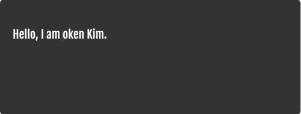
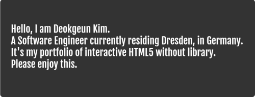

# Typing

A project to show how many animation effects can be shown in HTML5. This project is packaged as a library with webpack to reuse more easier.

It is a typing library to draw text in window. With any combination of function it make to write text as if you were actually typing.

Since this project runs as a message loop, it draws, moves, or deletes characters sequentially, even with many functions you type before `start()`.

## How to use

Set a font format with the class of `FontFormat` and a typing speed in the constructor of `Typing(fontFormat, speed)` and call animate on this instance recursively with `window.requestAnimationFrame()`.

You can use any combination of functions: `type(text, delayTime = 0), move(index, delayTime = 0), moveFront(delayTime = 0), moveEnd(delayTime = 0), delete(count, delayTime = 0), delay(time)`.
And finally you need to set `start()` to run the command.

```js
const fontFormat = new FontFormat(400, 50, 'Fjalla One', 'White');
const typingSpeed = 30;
const typing = new Typing(fontFormat, typingSpeed);
typing.resize();

typing
  .delay(1000)
  .type('Hello,', 100)
  .type(' I am Token Kim.', 100)
  .move(-10, 50)
  .delete(5, 50)
  .type('Deokgeun', 50)
  .moveEnd(100)
  .type(['', 'A Software Engineer of C/C++'], 100)
  .move(-8, 50)
  .delete(8, 50)
  .type('currently residing Dresden, in Germany.', 100)
  .type(['', "It's my portfolio of HTML5"], 100)
  .move(-5, 50)
  .type('interactive ', 100)
  .moveEnd(1000)
  .type(' without library.', 100)
  .type(['', 'Please enjoy this. '], 50)
  .start();

window.requestAnimationFrame(animate);

function animate(curTime) {
  fotKineticText.animate(curTime);
  window.requestAnimationFrame(animate);
}
```

## Used tools

- HTML5
- CSS3
- JavaScript

## Overview

A black background banner has been implemented here later. So if you use it directly above your code, this input will start at the top left position of the window without the background banner.

  
  
  

## Page

https://tokenkim92.github.io/Typing/
